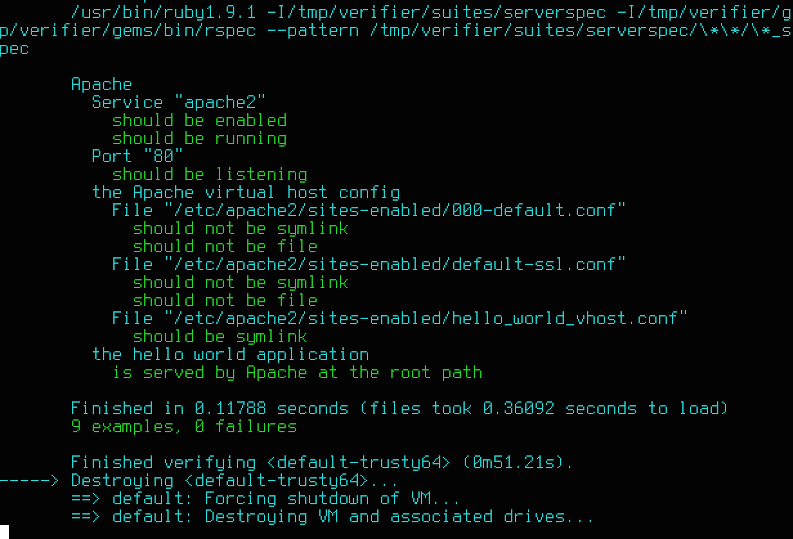

title: KitchenCI
author:
  name: Mike Ball
  url: https://github.com/mdb
output: index.html
theme: sjaakvandenberg/cleaver-dark

---

# Testing Infrastructure with KitchenCI

## Mike Ball

---

# Prologue

---

### How do we ensure quality software?

* automated tests
* automated quality checks
* continuous integration

---

### What about the universe beyond the application?

Or at least its infrastructure?

---

### KitchenCI

"Your infrastructure deserves tests too."

http://kitchen.ci

---

### What?

* packaged via `test-kitchen` gem
* test harness to execute code
* run code on various cloud providers and virtualization technologies
* [Serverspec](http://serverspec.org/) tests guarantee behavior

---

# Serverspec?

---

### Serverspec.org

Rspec tests for your infrastructure!

```ruby
describe service('apache2') do
  it { should be_enabled }
  it { should be_running }
end

describe port(80) do
  it { should be_listening }
end
```

---

# An example

---

### github.com/mdb/test-kitchen-example

```
├── Gemfile
├── Gemfile.lock
├── README.md
├── ansible
│   ├── playbook.yml
│   ├── requirements.yml
│   └── templates
│       └── hello_world_vhost.conf.j2
├── index.html
├── test
    └── integration
        └── default
            └── serverspec
                ├── apache_spec.rb
                └── spec_helper.rb
```

---

### test-kitchen-example

* provision a basic server with Ansible
* test that it functions as spec'd

---

### Install dependencies

Gems:

```
bundle install
```

Ansible roles:

```
ansible-galaxy install --role-file=ansible/requirements.yml --roles-path=ansible/roles
```

---

### .kitchen.yml

wire up test-kitchen

```
driver:
 name: vagrant
 provision: true
 vm_hostname: apache

provisioner:
 name: ansible_playbook
 playbook: ansible/playbook.yml
 roles_path: ansible/roles
...
```

---

### A Note on Ansible

```
ansible/playbook.yml
```

* authored in Ansible's YML-based configuration language
* installs & configures Apache on a machine
* deploys an `index.html` to the Apache root

---

### The Tests

```ruby
test/integration/default/serverspec/*_spec.rb
```

Example:

```ruby
describe 'the hello world application' do
  let(:hello_world) { Net::HTTP.get(URI('http://localhost:80')) }

  it 'is served by Apache at the root path' do
    expect(hello_world.include? '<h1>Hello World!</h1>').to eq true
  end
end
```

----

```
bundle exec kitchen test
```

1. provision
2. test
3. destroy

----

### Demo


----



----

### Thanks!

github.com/mdb/test-kitchen-example

----
